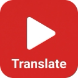

# YouTube Subtitle Translator (YouTube 双语字幕翻译助手)

A powerful Chrome extension that provides real-time, dual-subtitle translation for YouTube videos. Seamlessly translates English subtitles into your preferred language (default: Simplified Chinese) and offers an integrated dictionary lookup for English learning.

**这是一个強大的 Chrome 擴充功能，為 YouTube 影片提供實時雙語字幕翻譯。它可以無縫地將英文字幕翻譯成您偏好的語言（默認：簡體中文），並提供集成的字典查詢功能，助您輕鬆學習英語。**

## ✨ Features (主要功能)

*   **Real-time Dual Subtitles**: Displays original English subtitles and translated subtitles simultaneously.
    *   **實時雙語字幕**：同時顯示原始英文字幕和翻譯字幕。
*   **Integrated Dictionary**: Hover over any word to see definitions, phonetics, and usage examples.
    *   **內置字典**：鼠標懸停在任意單詞上即可查看定義、音標和例句。
*   **Smart Pagination**: Dictionary tooltip uses a pagination system to display comprehensive definitions without scrolling issues.
    *   **智能分頁**：字典浮窗採用分頁系統，無需滾動即可查看完整釋義。
*   **Audio Pronunciation**: Click the speaker icon to hear the correct pronunciation of words.
    *   **真人發音**：點擊喇叭圖標即可聽到單詞的標準發音。
*   **Customizable Settings**: Toggle translation, dictionary, or phonetic display via the popup menu.
    *   **個性化設置**：通過彈出菜單開關翻譯、字典或音標顯示。
*   **Completely Free**: Uses free APIs (Google Translate & Free Dictionary API).
    *   **完全免費**：使用免費的翻譯和字典 API。

## 🚀 Installation (安裝指南)

### From Chrome Web Store (Recommended)
*(Link will be available after publication)*

### Manual Installation (Developer Mode)
1.  Download the latest release `.zip` file from the [Releases](https://github.com/yourusername/youtube-subtitle-translator/releases) page.
2.  Unzip the file to a folder.
3.  Open Chrome and navigate to `chrome://extensions/`.
4.  Enable **Developer mode** in the top right corner.
5.  Click **Load unpacked** and select the unzipped folder.
6.  Go to YouTube and enjoy!

### 手動安裝（開發者模式）
1.  下載最新的 `.zip` 壓縮包。
2.  解壓到一個文件夾。
3.  打開 Chrome 瀏覽器，輸入 `chrome://extensions/` 進入擴充功能頁面。
4.  打開右上角的 **開發者模式 (Developer mode)** 開關。
5.  點擊 **加載已解壓的擴充功能 (Load unpacked)**，選擇剛才解壓的文件夾。
6.  打開 YouTube 即可使用！

## 📖 Usage (使用說明)

1.  **Activate**: The extension activates automatically on YouTube video pages.
2.  **Translate**: Subtitles will be translated and displayed below the original ones automatically.
3.  **Dictionary**: Hover your mouse over any word in the subtitles to see its definition.
    *   Use the **<** and **>** buttons to flip through definition pages.
    *   Click the **Speaker** icon to play pronunciation.
4.  **Settings**: Click the extension icon in the toolbar to change target language or toggle features.

## 🔒 Privacy (隱私說明)

We value your privacy. This extension:
*   Does **NOT** collect or store any personal user data.
*   Sends subtitle text to Google Translate API solely for the purpose of translation.
*   Sends selected words to Dictionary API solely for definition lookup.
*   All data processing happens locally in your browser.

詳見 [PRIVACY.md](PRIVACY.md)。

## 🛠 Tech Stack (技術棧)

*   **Frontend**: HTML, CSS, JavaScript (Vanilla)
*   **APIs**:
    *   Google Translate API (Free endpoint)
    *   Free Dictionary API (api.dictionaryapi.dev)
*   **Platform**: Chrome Extension Manifest V3

## 🤝 Contributing

Contributions are welcome! Please feel free to submit a Pull Request.

## 📄 License

This project is licensed under the MIT License - see the [LICENSE](LICENSE) file for details.
